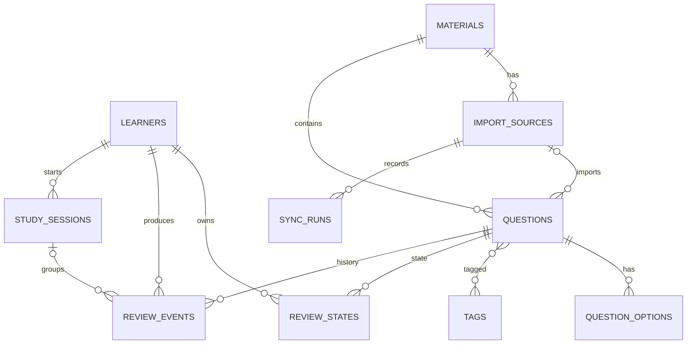

# Ponkan architecture

Ponkan 3 is a small self-hosted **study platform**, not an English-vocabulary-specific application.
The same domain services are exposed to a browser through REST and to LLM clients through MCP.

```text
Browser / SPA                          MCP client
        │                                  │
        │ REST /api/v1                     │ Streamable HTTP /mcp/
        ▼                                  ▼
┌──────────────────────────────────────────────────┐
│ FastAPI ASGI application                         │
│  ├─ REST router                                  │
│  ├─ MCPServer mount                              │
│  ├─ optional bearer-token middleware             │
│  └─ built React/Vite assets                      │
└───────────────────────┬──────────────────────────┘
                        │
                 domain/service layer
                        │
                SQLAlchemy 2 + Alembic
                        │
                   PostgreSQL 16
```

## Why PostgreSQL instead of SQLite

SQLite was appropriate for the static/local prototype, but Web + MCP introduces concurrent readers and potentially concurrent writers. PostgreSQL gives Ponkan:

- predictable concurrent writes from REST and MCP;
- transactional syncs;
- JSONB for importer metadata;
- better indexes and query growth room;
- a clearer path to multiple learners later.

The application is still a two-container deployment: `app` and `db`.

## Domain model

A **Material** is what the user selects for study. An **ImportSource** is where content is synchronized from. They are deliberately separate: a material can be manually maintained, have one Google Sheet, or eventually aggregate several imports without changing learning history.



### Material vs ImportSource

`materials` is user-facing study organization. `import_sources` is provenance and synchronization configuration. Deleting an import source does **not** delete the questions it already created: the FK is `SET NULL`. Archiving a material hides it from study but does not erase review events.

### Questions

A question is deliberately generic:

- `prompt` / `answer`
- `question_type`: `auto`, `card`, `multiple_choice`
- `prompt_lang` / `answer_lang`
- normalized `question_options`
- normalized tags
- JSONB metadata for importer-specific fields
- `external_key` + `content_hash` for stable synchronization

This supports vocabulary, Russian/Chinese, certifications, history, law, internal training, etc.

### Review state and event log

`review_events` is append-only learning evidence. Each answer records rating, response time, algorithm inputs/outputs and session ID.

`review_states` is the materialized current state used for fast scheduling. It can be rebuilt or migrated from events if the scheduling algorithm changes later.

This split is intentional. A single mutable `progress` row loses the history needed to explain or migrate SRS state.

### Synchronization semantics

Synchronization keys imported rows by `(import_source_id, external_key)`.

- new external key -> create question;
- same key + changed content hash -> update question;
- missing external key -> archive question;
- reappearing key -> unarchive/update question.

Review history is therefore retained across spreadsheet edits and temporary row removal.

## SRS

The current algorithm is named `ponkan-srs-v1`. The DB stores `algorithm_version` so it can be replaced without pretending old states were produced by the new formula.

Ratings are:

1. Again
2. Hard
3. Good
4. Easy

The conceptual recall model remains:

```text
R(t) = 0.9 ^ (t / stability)
```

Wrong answers reduce stability and count a lapse. Hard/Good/Easy grow stability by different factors that also consider estimated recall. `review_events` stores before/after stability and difficulty for auditability.

## MCP

MCP is mounted into the same ASGI process rather than deployed as a separate service. Advantages:

- no duplicated domain code;
- REST and MCP obey the same transactions and archival rules;
- one origin and one optional bearer token;
- fewer containers to operate at home.

The transport is MCP Streamable HTTP at `/mcp/`. DNS-rebinding host validation remains enabled and must be configured with the actual LAN/reverse-proxy host.

## Security boundaries

Ponkan is intended for a trusted home environment.

- `PONKAN_API_TOKEN` optionally protects REST + MCP with a bearer token.
- MCP Host/Origin allowlists stay enabled.
- remote CSV imports are HTTPS-only and host-allowlisted; every redirect target is revalidated to reduce SSRF risk.
- credentials are not stored in import metadata in v3; Google Sheets are assumed to be publish/read-only URLs.
- internet exposure should still use Tailscale/WireGuard or a TLS/authenticating reverse proxy.
